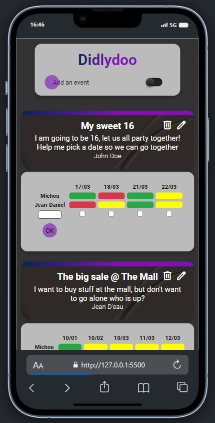
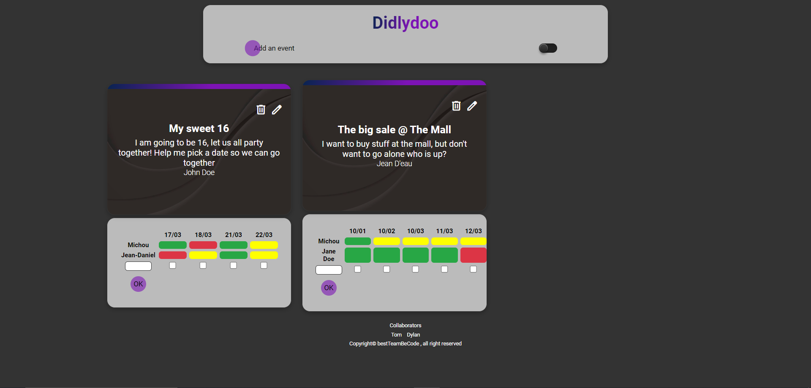

# Didlydoo - Organisateur d'évènement

## Présentation

Didlydoo est un projet réalisé dans le cadre de la formation BeCode. Il s'agit du dernier projet en JS vanilla, à réaliser en groupe de 3 sur 4 jours. Au final, nous étions 2 pour réaliser ce projet. 

## Objectifs généraux

En tant que projet final, celui-ci nous oblige à travailler toutes les bases apprises précédemment :

🌱 Afficher tous les événements, y compris la disponibilité de chacun

🌱 Permettre aux utilisateurs de créer des événements

🌱 Permettre aux utilisateurs d'ajouter leur disponibilité à un événement existant

🌱 Modifier le nom, la description ou l'auteur d'un événement

🌱 Supprimer un événement

🌱 Vous devez valider vos entrées avant d'envoyer les données à votre backend, les champs requis doivent être remplis et faire moins de 256 caractères. Si ce n'est pas le cas, vous n'envoyez pas la requête et affichez l'erreur appropriée sous l'entrée.

## Language utilisé

## Apercu

## Collaborator 

Tom - https://github.com/Xeless
Dylan - https://github.com/HappyFeys
Adrien - https://chatgpt.com/

## Défi et difficulté

Au cours de ce projet, nous avons rencontré quelques soucis ...
Tout d'abord, nous avons dû nous adapter au fait que notre 3ème collègue soit tombé malade pour la semaine.
Ensuite, nous avons eu quelques problèmes quant à la mise en place du DOM, ajouter les bonnes personnes dans la bonne table par exemple.
Aussi, c'était la première fois que l'on touche au 'GET', 'POST', 'DELETE lorsqu'on travaille avec une API. Il a fallu se pencher la dessus.

## Remerciement

On tient à remercier :
    - Illies
    - Caroline
    - Nath

